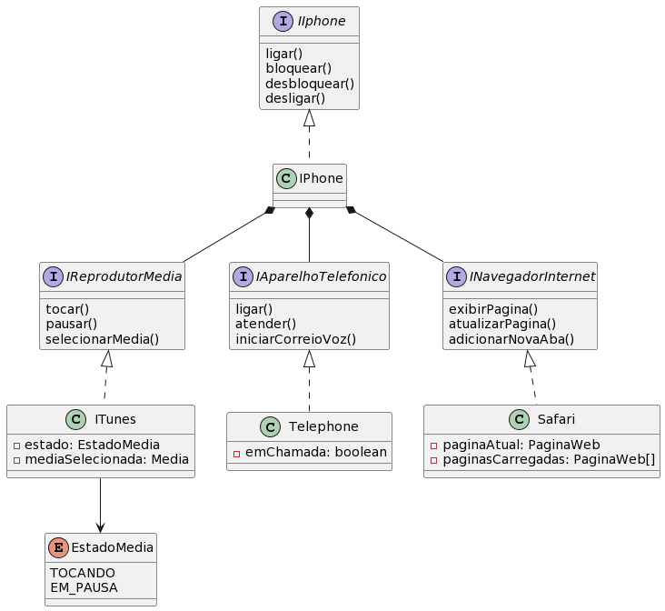

# DIO - Trilha Java Básico
www.dio.me

#### Autor
- Rafael da Silva

## POO - Desafio

### Descrição da implementação
Utilizei interfaces para especificar os comportamentos esperados, até mesmo para o aparelho Iphone.

A classe concreta do Iphone usa composição baseada nas interfaces de cada um dos serviços necessários (telefone, reprodutor de media e navegador).

Para cada interface serviço/feature há uma implementação concreta que é atribuida no objeto Iphone em sua construção, e os respectivos atributos são _final_ para evitar alterações.

Existe uma classe Media e uma enum EstadoMedia, residentes no pacote **apple.iphone.media** que possuem visibilidade apenas de pacote.

Os atributos dos objetos concretos foram mantidos _private_ e sem getters/setters dado a simplicidade da atividade proposta.

**Diagrama de classe**

_Diagrama feito via site [PlantUML](https://plantuml.com)_

